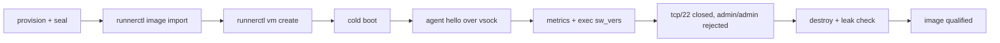

# macOS guest runners (M8)

**Status: runtime landed and proven once live (M8.0–M8.4), hardened (H1–H2), not yet qualified.**
`os: macos` profiles validate, `vmworker` boots a macOS guest from a `VZMacPlatformConfiguration`,
every instance has its own machine identifier, and on 2026-08-27 a Tart-derived macOS 26.6.2 image
ran a real GitHub Actions job end to end on this host (23 s cold start, VM removed afterwards —
evidence in `docs/verification.md` "M8"). The 2026-08-28 hardening pass closed the security and
correctness gaps below. Open: the H3–H5 live runs (two concurrent guests + third-job-waits,
crash/restart recovery, the 100-job soak) and the native IPSW builder (M8.6). Track progress in
`TODO.md` ("M8"). Treat macOS as **experimental** until H3–H5 are recorded.

## Shape of the milestone

macOS is another *guest platform*, not another runner subsystem. Everything above the VM —
scheduler, JIT registration, ephemeral lifecycle, autoscaling, recovery, image store, OCI transport,
guest-agent protocol — is reused unchanged. Only `vmworker` (the one binary that links
Virtualization.framework) knows about `VZMacHardwareModel`, `VZMacMachineIdentifier`,
`VZMacAuxiliaryStorage`, `VZMacPlatformConfiguration` and `VZMacOSBootLoader`.

The order is deliberate: **boot a known-good, pre-provisioned macOS image and run a GitHub job
first; build RunnerVM's own IPSW-based image pipeline last.** Those are two separate hard problems
and the first one is the one that proves the runtime.

| Step | What | Where |
|------|------|-------|
| M8.0 | green baseline — done | `a771905` (a flaky poll made event-driven) |
| M8.1 | identity plumbing — done | `MacOSInstancePlatformSpec`, `VMInstanceSpec.macos`, `machine-identifier.bin`, `MacOSMachineIdentity`, image minimums, admission checks |
| M8.2 | platform builder — done live | `MacOSVMPlatform`, `HostConstants.supportedGuestOS` includes `.macos`, ephemeral-only rule, `image import --hardware-model` |
| M8.3 | guest agent over vsock — **done live** | `scripts/provision-macos-tart.sh` prepares a Tart base image (runner user, agent LaunchDaemon, `actions/runner` osx-arm64) |
| M8.4 | GitHub JIT job end to end — **done live** | `runs-on: rvm-macos-26` (the profile name; a profile named like a GitHub-hosted label is now refused — `PROFILE_NAME_SHADOWS_HOSTED_LABEL`) |
| M8.5 | concurrency + recovery | two guests, third blocked by the scheduler, crash/restart, 100 short jobs |
| M8.6 | native IPSW builder | `runnerctl image build-macos`, a separate builder from the Runnerfile one |

The 2026-08-28 hardening pass sits between M8.4 and M8.6, deliberately: the live run already proved
the runtime architecture, so replacing Tart with an IPSW installer and finishing the hardening are
two separate risk domains and are not combined.

| Phase | What | Where |
|-------|------|-------|
| H1 | security + correctness — done | seal-time SSH lockdown · exact macOS disk contract · durable machine-ID write · no seal after a forced stop · LaunchDaemon fails closed · hosted-label collision is an error · second capacity fence · payload manifest |
| H2 | image qualification — script done, run pending | `scripts/qualify-macos-image.sh` |
| H3 | concurrency — pending hardware | `scripts/live-macos-e2e.sh --scenario concurrency` |
| H4 | recovery matrix — pending hardware | `scripts/live-macos-e2e.sh --scenario recovery` |
| H5 | soak — pending hardware | `scripts/live-macos-e2e.sh --scenario soak` |
| H6 | observability | OS-aware guest diagnostics done; one correlation key across host/`_diag`/agent logs open |

## Identity model

Three Apple objects, three different owners:

| Object | Owner | RunnerVM home |
|--------|-------|---------------|
| `VZMacHardwareModel` — which virtual Mac the installed OS supports | the **image** | `ImageMetadata.macos.hardwareModel` (opaque base64; decoded only in `vmworker`) |
| `VZMacAuxiliaryStorage` — NVRAM-like mutable state tied to the hardware model | image template, **cloned per instance** | image `nvram` layer → `instances/<id>/nvram.bin` |
| `VZMacMachineIdentifier` — the guest's ECID | the **instance** | `instances/<id>/machine-identifier.bin`, minted by `vmworker` on first boot after it holds `worker.lock`, reused on every restart, never sealed into an image |

Apple documents that two concurrently running VMs must not share a machine identifier; the
per-instance file plus the lock is what guarantees they never do. Clone A ≠ clone B; restart of
A = A. `ImageMetadata` never carries instance identity (spec §24), which is also why a Tart
import keeps the hardware model but drops Tart's `ecid` and MAC.

The image additionally records `macos.minimumCPUCount` / `macos.minimumMemoryBytes` (from
`VZMacOSConfigurationRequirements`, or Tart's `cpuCountMin`/`memorySizeMin`). A profile sized below
them is refused at `create` with `VM_MACOS_PROFILE_CPU_TOO_SMALL` /
`VM_MACOS_PROFILE_MEMORY_TOO_SMALL` before any row or clone exists, instead of a bare
`VZVirtualMachineConfiguration validation failed` later.

## Platform configuration

`MacOSVMPlatform` (VirtualizationCore) builds: `VZMacOSBootLoader`; `VZMacPlatformConfiguration`
with the decoded hardware model (`isSupported` is checked — a restore image can describe hardware
this host cannot run, surfaced as `VM_MACOS_HARDWARE_MODEL_UNSUPPORTED`), the instance's auxiliary
storage and machine identifier; and **one virtual display (1920×1080 @ 80 ppi) with no window**.
Apple's configuration API permits an empty graphics array, but Apple's own macOS samples and Tart
both configure a display even when running headless, so RunnerVM does the same. "No GUI window on
the host" ≠ "no virtual GPU in the guest". Booting without any display is a later experiment, not
an M8 blocker. The rest (virtio block with `.cached`, NAT network with a per-instance MAC, vsock,
entropy, serial port) is the shared `VMConfigurationBuilder` path Linux uses.

## Concurrency cap

RunnerVM runs at most **two** concurrent macOS guests per host (`HostConstants.macOSGuestLimit`),
enforced at admission and in advertised capacity. That number matches Apple's standard macOS
license allowance (two additional macOS instances per Apple-branded Mac already running macOS)
and the supported Virtualization.framework operating model; it is a policy default, not a
framework error RunnerVM waits for. Consequence: a warm idle macOS VM permanently consumes half
the host's macOS capacity, so `minIdle: 0` is the default and cold-start latency is measured before
anyone opts into a warm pool.

The ceiling is fenced **twice**. runnerd's admission check (`CapacityCalculator`) is what an
operator normally hits, and it feeds the same number into advertised capacity. `MacOSGuestSlot`
(`Sources/VirtualizationCore/MacOSGuestSlot.swift`) is the second fence: every macOS `vmworker`
takes an `fcntl` record lock on `<runtime>/macos-slot-N.lock` before it creates the
`VZVirtualMachine` and holds it for the process's whole life. A second runnerd against the same
runtime directory, a recovery path that mis-counts, or `vmworker run` invoked by hand therefore
cannot exceed two managed macOS guests. The kernel drops the lock when the holder dies, so a
crashed worker never leaks a slot and nothing has to reap the files.

## Ephemeral only (v1)

`lifecycle: reusable` with `os: macos` is rejected (`PROFILE_MACOS_REUSABLE_UNSUPPORTED`). A macOS
job leaves far more state than a Linux one — login/temporary keychains, code-signing identities,
provisioning profiles, `~/Library/Developer`, DerivedData, SwiftPM and git credential caches,
simulator state — and resetting `$HOME` does not cover it. Reusable macOS can be qualified
separately later.

## Disk sizing: `resources.disk` must equal the image

A macOS guest cannot resize its APFS container. The host truncates `disk.img` up before boot
(`VMDirectoryStaging`) and the *guest* is what turns that space into filesystem — on Linux, the
guest agent's `agent.resizeDisk`; on darwin that method answers `NOT_SUPPORTED`, because growing an
APFS container needs a recovery story RunnerVM does not have yet.

So a macOS profile asking for more disk than its image carries used to advertise capacity the job
never received: a 100 GiB raw disk and the image's original 60 GiB root volume. Both directions are
now refused at admission, in `plan`, before any row or clone exists:

```
resources.disk != <the image's disk layer>   ->   VM_MACOS_DISK_RESIZE_UNSUPPORTED
```

The error names the exact figure to use. `runnerctl image inspect <name>` shows it as "virtual
size". When the image is the wrong size, rebuild the image — not the profile.

## Image security: what the seal-time lockdown removes

The Tart base images this pipeline starts from ship a well-known `admin`/`admin` administrator with
Remote Login enabled. That is fine for the disposable build VM and unacceptable in an image every
CI guest is cloned from: each clone would carry the same working credential, reachable on the
guest's NAT address, in front of an untrusted workload.

`scripts/provision-macos-tart.sh` therefore ends with a lockdown stage
(`STAGE=harden` in `scripts/lib/macos-guest-provision.sh`) that runs in its own SSH session, after
the self-check has been read, because it ends by disabling the very channel it arrives on:

| Step | Why |
|------|-----|
| rotate the build account's password to a discarded 64-character random value | the account is the first administrator and the Secure Token owner, so it is kept, not deleted |
| `dscl . -authonly <user> <old password>` must now fail | the proof, not the intent |
| remove every `authorized_keys` under `/Users/*` and `/var/root` | a key survives a password change |
| `launchctl disable system/com.openssh.sshd` | the persistent override database, so it stays off across boots |
| `systemsetup -f -setremotelogin off`, then a graceful halt, both detached | closes the port for this boot too; detached because it kills the session |

The guest writes an `RVM-HARDEN-V1` block *before* any of that, so the evidence survives the
session dying, and the host refuses to seal without it. `--debug-ssh` skips the whole stage and
records `capabilities.ssh: true` in the sealed metadata, so a debugging image is never mistaken for
a production one.

Nothing is lost: RunnerVM manages the finished guest over vsock, and `runnerctl vm exec` does not
use SSH.

## Image qualification: the cold-boot gate

> A macOS image is not valid because the build script finished. It is valid because RunnerVM
> successfully cold-booted a clone of it.

A provisioning run can only check the guest it is sitting inside, over the channel it is about to
destroy. That misses everything that only appears on a fresh boot of a *clone*: a LaunchDaemon that
loaded once but does not start at boot, auxiliary storage the clone cannot use, a hardware model
this host will not run, an SSH lockdown that did not survive the reboot.

```bash
scripts/qualify-macos-image.sh --profile rvm-macos-26 --state-dir ~/runnervm-dev
```



It exits non-zero if any check fails and writes a JSON report either way. `--allow-ssh` records the
SSH checks as skipped for an image built with `--debug-ssh`.

## Guest side

The Go guest agent already runs on darwin/arm64 with a native `AF_VSOCK` listener and ships a
LaunchDaemon (`GuestAgent/packaging/launchd/com.runnervm.guest-agent.plist`, root). The runner
itself runs as the unprivileged `runner` account from `/Users/runner/actions-runner`. vsock stays the
control plane: no IP discovery, no SSH keys, no network dependency for host→guest management.
SSH remains optional and useful for image development.

Provisioning of the bootstrap image (M8.3) is done over SSH **once, at image-build time**, by
`scripts/provision-macos-tart.sh` against a Tart base VM:

- create `runner`, install the agent + LaunchDaemon, install `actions/runner` osx-arm64 (host-verified
  sha256), Xcode Command Line Tools if absent;
- **required**: `sudo -H -u runner git config --global credential.helper ""` — as `runner`, with
  `HOME=/Users/runner`, an empty override (not `--unset-all`). `actions/checkout` injects its token
  via `http.extraheader`, so no credential helper is ever needed, and a Keychain-backed helper on a
  headless guest blocks forever with no prompt to answer (a real incident on a manually managed
  macOS runner). Done at provisioning time, not per job;
- **explicitly open**: a usable login keychain on a cold-booted, never-logged-in clone for tools
  such as `codesign`/`notarytool`. Signing material must be injected per job (temporary keychain
  created and destroyed inside the job) rather than baked into the image; whether that works
  headless needs its own spike with a cold-boot test.

Xcode is image-level state (`macos-26-base`, `macos-26-xcode-26.x`, …), never installed per job.

## Native image builder (M8.6, later)

`VZMacOSRestoreImage` → `mostFeaturefulSupportedConfiguration` → disk + auxiliary storage +
installer machine identifier → `VZMacOSInstaller` → first boot → account + agent bootstrap →
everything else over the vsock RPC channel → seal. `VZMacOSInstaller` only puts macOS on a disk;
Setup Assistant automation, account creation and agent bootstrap are the hard, brittle part and
are why this is a separate `MacOSRestoreImageBuilder`, not `if os == .macos` branches inside the
Linux Runnerfile builder. Until then the Tart base image is the compatibility oracle.

## Qualification gate (before "supported")

Per-image (`scripts/qualify-macos-image.sh`, automated): cold boot · unsupported hardware model
gives a typed error · agent over vsock, no SSH · LaunchDaemon loaded after a real boot ·
`admin/admin` rejected and TCP/22 closed · clean teardown · image digest unchanged.

Per-host (`scripts/live-macos-e2e.sh`, needs hardware): unique machine ids across clones and stable
across restart · two concurrent guests, third blocked by the scheduler · ephemeral JIT job · public
and private checkout · `xcodebuild`/SwiftPM · credential helper never invoked ·
cancellation/timeout · vmworker crash + runnerd restart recovery · drain · OCI push/pull/boot ·
Tart import → job · 100 short jobs.

Every scenario ends in the same invariants, which is what turns a success counter into a real
check:

```
GitHub runners for the profile   == 0
non-terminal sessions            == 0
capacity-consuming instances     == 0
instance directories             == 0
vmworker processes               == 0
macOS guest slots held           == 0
image digest                     == unchanged
```

## Host facts (this machine, 2026-08-27)

macOS 26 (Tahoe) on Apple Silicon; Apple's catalog offers 26.6.2 (25G83), minimum 2 vCPU / 4 GiB
for its most featureful configuration. `VZMacOSRestoreImage.fetchLatestSupported` needs the
virtualization entitlement (sign a probe with `Resources/vmworker-dev.entitlements`). Free disk was
74 GiB at M8 start — one Tart base image (~27 GB compressed) fits; Xcode images will not until
space is reclaimed.
